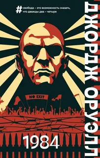
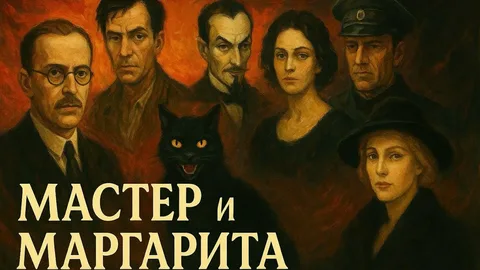
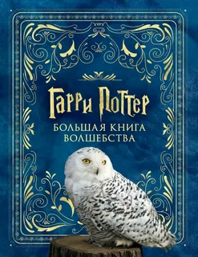
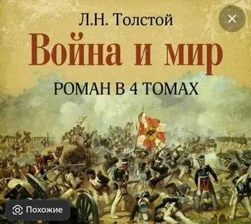
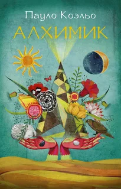
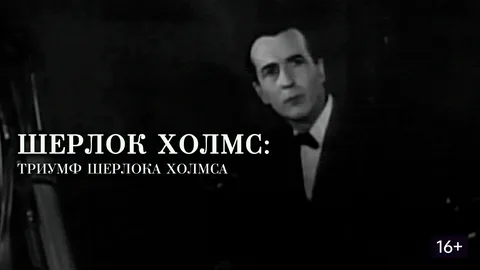

<!DOCTYPE html>
<html lang="ru">
<head>
<meta charset="UTF-8">
<title>Книжный магазин</title>
<link rel="stylesheet" href="style.css">
</head>

<body>

<h1>📚 Книжный магазин</h1>

    

        
        <h2>1984</h2>
        
«1984» последняя книга Джорджа Оруэлла, он опубликовал ее в 1949 году, за год до смерти. Роман-антиутопия прославил автора и остается золотым стандартом жанра. Действие происходит в Лондоне, одном из главных городов тоталитарного супергосударства Океания. Пугающе детальное описание общества, основанного на страхе и угнетении, служит фоном для одной из самых ярких человеческих историй в мировой литературе.

    

    

        
        <h2>Мастер и Маргарита</h2>
        
Роман Михаила Афанасьевича Булгакова «Мастер и Маргарита», которому писатель посвятил 12 лет своей жизни, по праву считается настоящей жемчужиной мировой литературы. Произведение стало вершиной творчества Булгакова, в котором он затронул извечные темы добра и зла, любви и предательства, веры и неверия, жизни и смерти. Анализ «Мастера и Маргариты » нужен наиболее полный, поскольку роман отличается особой глубиной и сложностью.

    

    

        
        <h2>Гарри Поттер</h2>
        
представляет собой хронику приключений юного волшебника Гарри Поттера, а также его друзей Рона Уизли и Гермионы Грейнджер, обучающихся в школе чародейства и волшебства Хогвартс. Основной сюжет посвящён противостоянию Гарри и тёмного волшебника по имени лорд Волан-де-Морт, в чьи цели входит обретение бессмертия и порабощение магического мира.

    

    

        
        <h2>Война и мир</h2>
        
Роман Льва Толстого «Война и мир» лежит в
основании величественного здания русской классической
литературы. С непревзойденным мастерством Толстой
воссоздал великую духом Россию – образы этой «книги
на все времена» и сейчас пленяют свежестью чувств
и щедростью души, искренностью страстей, силой и
чистотой убеждений.
В книгу вошли первый и второй тома романа.

    

    

        
        <h2>Алхимик</h2>
        
Алхи́мик» (порт. O Alquimista) — роман авторства Пауло Коэльо, изданный в 1988 году и ставший мировым бестселлером. Издан более чем в 117 странах мира, переведён на 81 язык, в том числе на High Valyrian. Основной сюжет взят из европейского фольклора: по классификации фольклорных сюжетов Аарне-Томпсона-Утера — сюжет 1645 «Сокровище дома».

    

    

        
        <h2>Шерлок Холмс</h2>
        
Алхи́мик» (порт. O Alquimista) — роман авторства Пауло Коэльо, изданный в 1988 году и ставший мировым бестселлером. Издан более чем в 117 странах мира, переведён на 81 язык, в том числе на High Valyrian. Основной сюжет взят из европейского фольклора: по классификации фольклорных сюжетов Аарне-Томпсона-Утера — сюжет 1645 «Сокровище дома».

    

</body>
</html>
